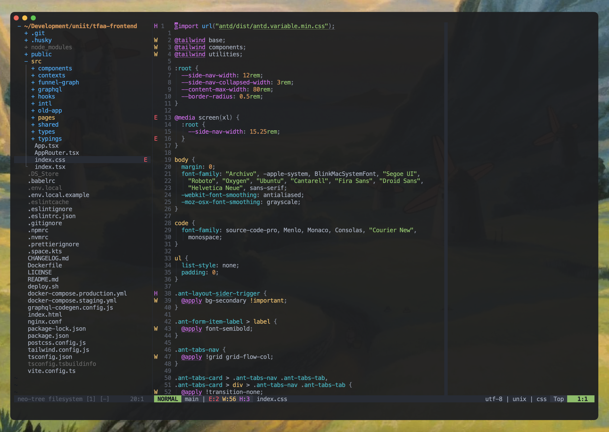

# Alacritty config

This my personal config for the [Alacritty terminal emulator](https://github.com/alacritty/alacritty).

## Preview



## How to use?

First of all, you need to have the Alacritty installed. Follow instructions on
its official repository page.

Then, navigate to your `.config` directory:

```bash
cd ~/.config
```

And finally, clone this repository:

```bash
git clone https://github.com/nizamiza/alacritty.git
```

Make sure to restart the Alacritty.

## Updating the config

The config file contains comments for each option. So everything is documented
in there. If some fields are missing, then most likely they're part of a new
version of Alacritty. You can find the latest config on the [releases page](https://github.com/alacritty/alacritty/releases).
