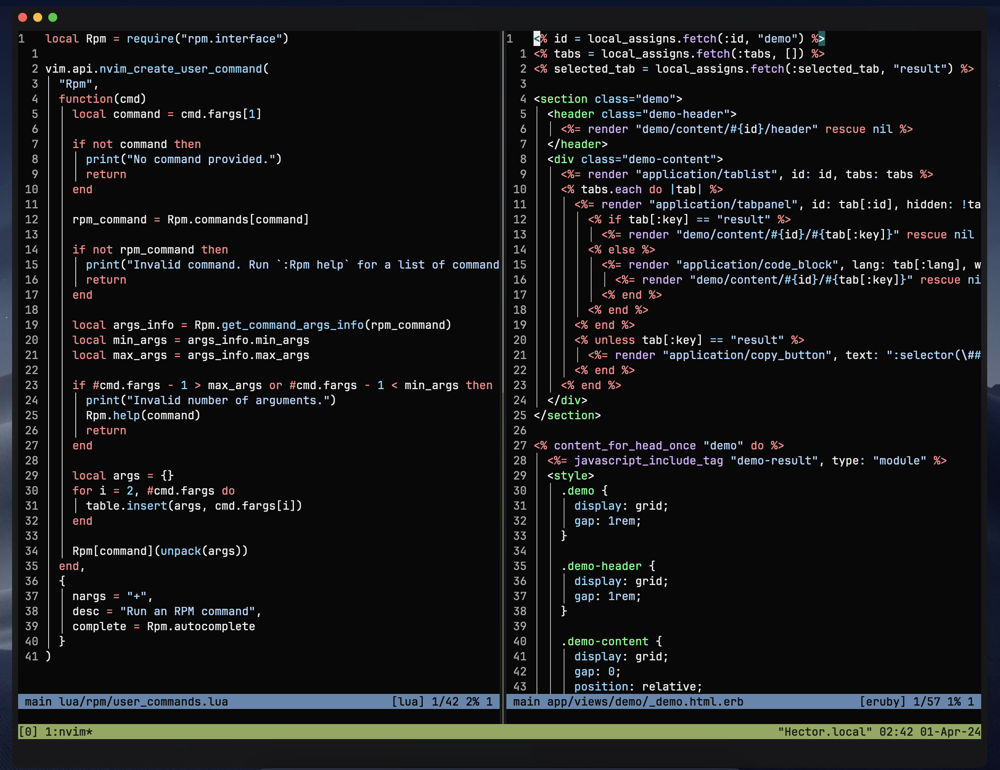

# Alacritty Config

This my personal config for the [Alacritty terminal emulator](https://github.com/alacritty/alacritty).

## Preview



## How to use?

Make sure to have the Alacritty installed on your system. Follow instructions on
its official repository page.

Then, backup your current Alacritty configuration if you have one:

```bash
mv ~/.config/alacritty ~/.config/alacritty.bak
```

And finally, clone this repository:

```bash
git clone https://github.com/nizamiza/alacritty.git ~/.config/alacritty
```

Make sure to restart Alacritty!

## Resources

-   [Alacritty](https://github.com/alacritty/alacritty)
